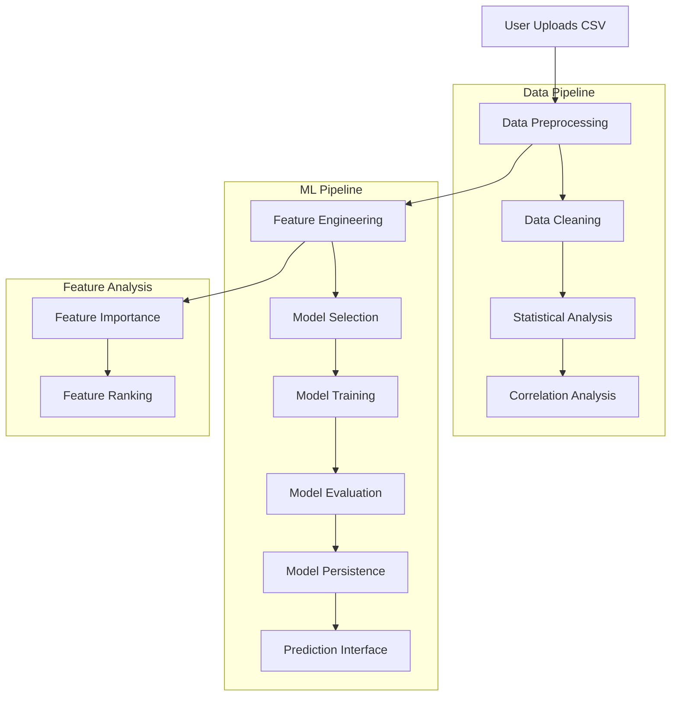
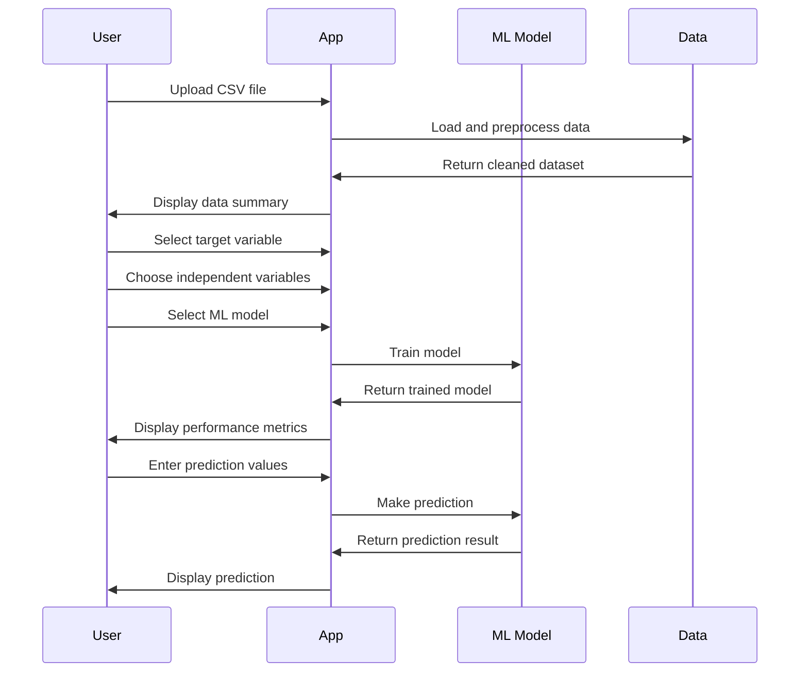

# Smart ML - Data Analysis Made Easy

<div align="center">


**Without big data analytics, companies are blind and deaf, wandering out onto the web like a deer on the freeway.** - Geoffrey Moore


</div>

## 📊 Overview

Smart ML is a comprehensive data analysis and machine learning application built with Streamlit. It provides an intuitive interface for users to upload datasets, perform data preprocessing, build machine learning models, and extract feature importance without requiring coding knowledge.

## 🚀 Features

### 📈 **Data Preprocessing**
- **File Upload**: Support for CSV file uploads
- **Null Value Detection**: Automatic identification and handling of missing values
- **Data Cleaning**: Fill missing values with mean for numeric columns
- **Statistical Analysis**: Comprehensive descriptive statistics
- **Correlation Analysis**: Interactive heatmaps for feature relationships
- **Data Export**: Download cleaned datasets

### 🤖 **Machine Learning Models**
- **Multiple Linear Regression**: For continuous target variables
- **Random Forest Classifier**: For classification tasks
- **Random Forest Regressor**: For regression tasks
- **Model Persistence**: Save trained models for future use
- **Real-time Prediction**: Interactive prediction interface

### 🔍 **Feature Extraction**
- **Feature Importance Analysis**: Identify most influential features
- **Column Management**: Remove unwanted columns
- **Categorical Encoding**: Automatic label encoding for categorical variables
- **Importance Ranking**: Sort features by their predictive power

## 🏗️ Architecture



## 📦 Installation

### Prerequisites
- Python 3.8 or higher
- pip package manager

### Setup Instructions

1. **Clone the repository**
   ```bash
   git clone <repository-url>
   cd insight
   ```

2. **Install dependencies**
   ```bash
   pip install -r requirements.txt
   ```

3. **Run the application**
   ```bash
   streamlit run mainapp.py
   ```

4. **Access the application**
   - Open your browser and navigate to `http://localhost:8501`

## 📋 Dependencies

```txt
streamlit>=1.28.0
pandas>=2.0.0
numpy>=1.24.0
scikit-learn>=1.3.0
matplotlib>=3.7.0
seaborn>=0.12.0
joblib>=1.3.0
```

## 🎯 Usage Guide

### 1. **Main Page**
- Welcome screen with application overview
- Contact information and developer details

### 2. **Data Preprocessing**
1. Upload your CSV file using the file uploader
2. View the original dataset
3. Check for null values and their distribution
4. Review cleaned data with filled null values
5. Download the cleaned dataset
6. Explore statistical summaries and correlations

### 3. **Regression and Prediction**
1. Select your target variable (dependent variable)
2. Choose independent variables for the model
3. Select a machine learning algorithm:
   - **Multiple Linear Regression**: For continuous outcomes
   - **Random Forest Classifier**: For classification tasks
   - **Random Forest Regressor**: For regression tasks
4. Train the model and view performance metrics
5. Use the prediction interface to make new predictions

### 4. **Feature Extraction**
1. Remove unwanted columns if necessary
2. Select the feature you want to predict
3. View feature importance rankings
4. Understand which features have the most impact on predictions

## 🔧 Configuration

### Environment Variables
```bash
# Optional: Set custom port
export STREAMLIT_SERVER_PORT=8501

# Optional: Set custom host
export STREAMLIT_SERVER_ADDRESS=localhost
```

### Customization
- Modify the color scheme in the `home()` function
- Add new machine learning models in the `mlr()` function
- Customize feature extraction methods in the `feature()` function

## 📊 Example Workflow




## 📈 Performance Metrics

- **Root Mean Square Error (RMSE)**: For regression models
- **Accuracy Score**: For classification models
- **Feature Importance**: For understanding variable impact

## 🔒 Security Considerations

- File upload validation
- Data sanitization
- Model persistence with secure file handling
- Input validation for predictions


## 📄 License

This project is licensed under the MIT License - see the [LICENSE](LICENSE) file for details.


<div align="center">

**Data is the future and the future is now!** 🚀

*Every mouse click, keyboard button press, swipe or tap is used to shape business decisions.*

</div> 